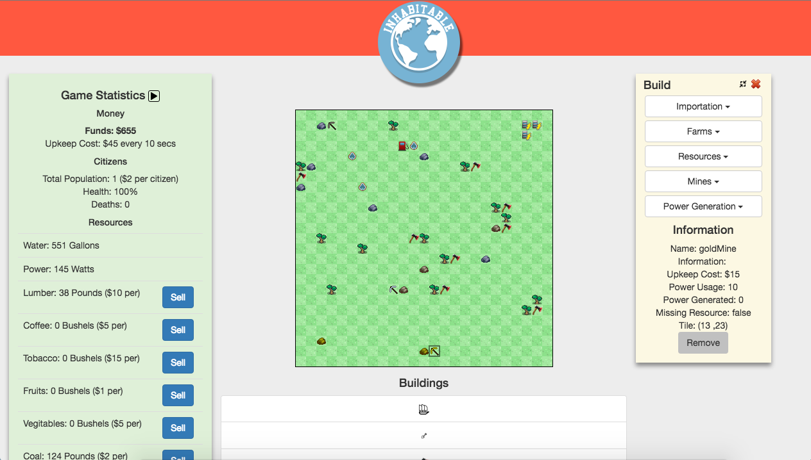

# Welcome to the source page for Inhabitable

[Play Online Here](http://www.jkaffrey.ninja/Q1-Project) || [Watch A Video About The Game](http://www.jkaffrey.ninja/Q1-Project/exampleVideo.html)

Information
------
Inhabitable is a survival based game with no real end goal; however, the player needs to make sure that their "Funds" do not go into the negative. If this is to occur the player loses and therefore has to restart the game. Each building has a cost and resources that are required to build it.

The game is simple. The player starts with a starter house that will generate $10 per 5 seconds, in addition the player gets $2 per citizen on their island. That means that a brand name game will generate $12 per 5 seconds. Outside of this there are no other buildings that generate funds so the only way that you can make money is by selling resources or placing airports or docks to bring in citizens. The resources are directly connected to the Commodity Stock Market and so the prices can change daily depending on how the market fluxes.

The buildings that collect resources (Lumber Mill, Water Pump and Iron, Gold and Coal Mines) need to be placed directly next to the resource that they are associated with them, here is an example image where 'R' is resource and 'X' are valid place locations.

|-X-|

|XRX|

|-X-|

If these aforementioned buildings are not correctly placed, they will NOT generate the resources that they need to.

##### Natural Resources
Natural resources are generated randomly each time the page is refereshed. In addition each natural resource has a random amount of resources contained within it. As long as this number is not 0, they can be harvested and generate you their associated resource. Once that number reaches 0, the building collecting the resource will no longer operate; however, this building will keep taking money to constitute for it's upkeep cost, remove the buidling to not lose money.

### Technologies and Coding
This game was developed entirely in JavaScript, JQuery, HTML and CSS. This resulted in some interesting challenges due to JavaScript's limited ability to create threads or timers, communicate with the server or draw to the screen. An HTML5 canvas element was used to draw the game board and a single JavaScript timer was used with a modulus check to 'simulate' multiple threads. An Agile workflow was used to keep on track and to complete all the challenges that were presented in the project.

### API Key and Quandl
This game uses the Commodity Stock Market data provided by http://www.quandl.com in order to determine prices, this requires an API key which can be obtained at their website. Once you get your key, go into ResourceQuery.js and set the apiKey variable to your api key.

### Licensing
This project is licensed under the terms of the MIT license. See LICENSE.txt for more information.
